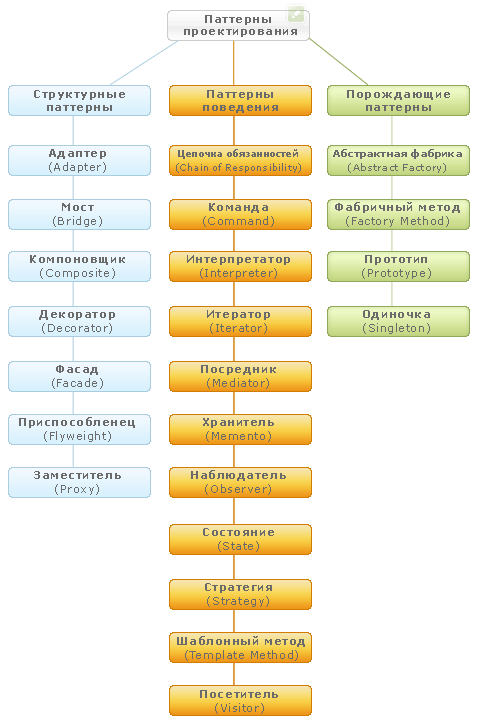

# Ресурсы по паттернам на python  
* Шпаргалка по видам паттернов с разбиением на группы  
  
  * Взято отсюда - https://proft.me/2008/12/8/primery-realizacij-patternov-proektirovaniya-v-php/
  * Ссылко на ресурсы со всеми прмерами паттернов реализованных на python  
    * https://github.com/faif/python-patterns  
    * https://sourcemaking.com/design_patterns
    * https://refactoring.guru/ru/design-patterns/template-method/python/example